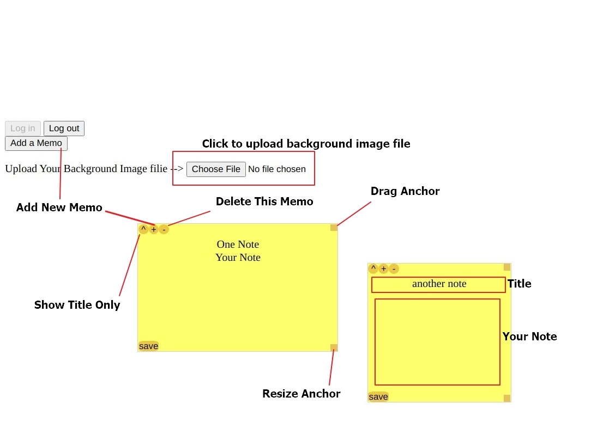

## Brief Introduction - Note-app
- Serverless application
- Post-it style note app using AWS lambda, DyanamoDB and so on
    - All CRUD operation supported
    - All data user creates is bound to the user
- Auth0.com **RS256** OAuth

## How to run loal client

- go to "front-end" directory
- run command below
    ```
    npm run dev
    ```
- open browser : http://localhost:3000

## Rubric Checklist

### (Option 2):Codebase
- The code is split into multiple layers separating business logic from I/O related code. (YES)
- Code is implemented using async/await and Promises without using callbacks.(YES)

### (Option 2):Best practices
- All resources in the application are defined in the "serverless.yml" file (YES)
- Each function has its own set of permissions.(YES)
    - Please check serverless.yml!
- Application has sufficient monitoring.(YES)
    - winston logging is used @ backend/src/lambda/auth/auth0Authorizer.ts
    - AWS X-ray is used
- HTTP requests are validated.(YES)
    - **request: schema: application/json:** block is used in serverless.yml

### (Option 2):Architecture
- Data is stored in a table with a composite key.(YES)
    - There're two tables, one is using a composite key
- Scan operation is not used to read data from a database.(NO)
    - Query or Get is used instead
